# UI组件
> 对组件的描述进行标准化。为以后做生成代码工具提供内容。

## 组件信息
* [组件定义](#define)
* [组件实现](#implement)

## 组件目录
* [原子组件&组合](#atom)
  * [表单元素](#form)
  * [提醒](#notice)
* [布局&容器组件](#layout)
* [基础组件](#basic)
* [业务组件](#business)

## <a name="atom">原子组件&组合</a>
原子组件指小颗粒的，基本不可拆分的组件。

### [按钮](components/button)

### [按钮组](components/button-group)
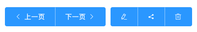

### [Badge 标记](components/badge)
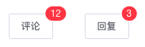  

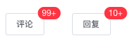  

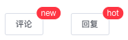  

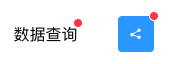

### [Tag 标签](components/tag)
  

### [Icon 图标/字体图标](components/icon)
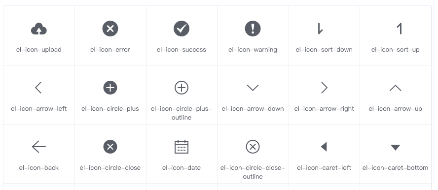

## <a name="form">表单元素</a>
### [Input 输入框 & 密码框 & 文本域](components/form/field)
  

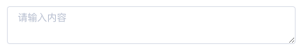

### [InputNumber 计数器](components/form/number)
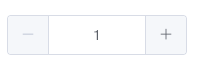  

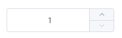

### [NumberKeyboard 数字键盘](components/form/number-keyboard)
  

### [单选框](components/form/radio)
  

### [多选框](components/form/checkbox)
  

### [Switch 开关](components/form/switch)
  

### Select 下拉框
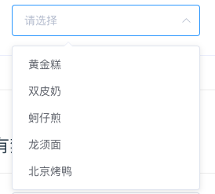  

### Cascader 级联下拉框
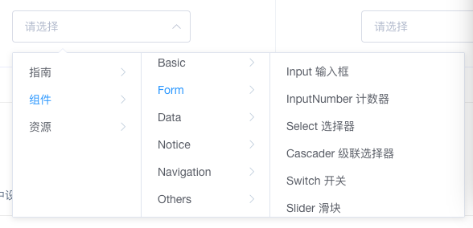  

### 时间选择器
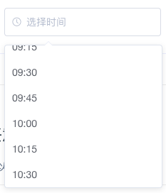  

### 日期选择器
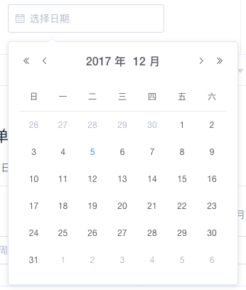  

### 日期时间选择器
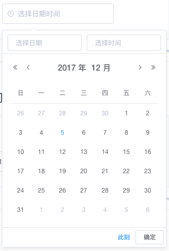

### 颜色选择器
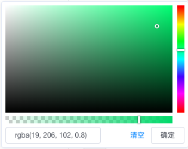  

### Slider 滑块
  

### 上传
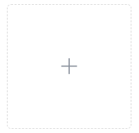  

### Progress 进度条
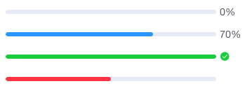  

## <a name="notice">提醒</a>
### Loading 加载
  

### Alert 警告
用于页面中展示重要的提示信息。非浮层元素，不会自动消失。

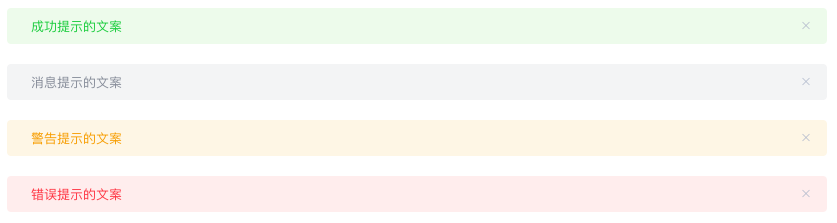  

### Message 消息提示
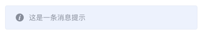  

### MessageBox 弹框
MessageBox 的作用是美化系统自带的 alert、confirm 和 prompt。

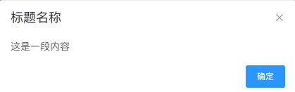  

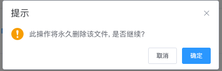  

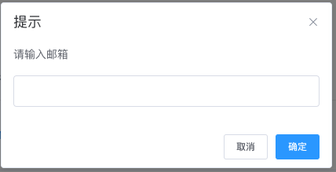  

### Notification 通知
悬浮出现在页面角落，显示全局的通知提醒消息。

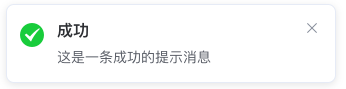  

## <a name="layout">布局&容器组件</a>
布局&容器组件中，可以放任意类型的其他组件。

### 删格

### 表单

### Tab 选项卡

### Cell 单元格
单行，两端对齐。

### Panel 面板
放自定义内容。

### Alert 框

### Confirm 框

### 弹出框

### 多媒体(Media)组件
图/音乐/视频 + 文字。

## <a name="basic">基础组件</a>

### [NavBar](components/navbar)

头部导航栏。

### 搜索栏

### [TabBar](components/tabbar)

底部选项卡。

### Breadcrumb 面包屑 
别名：路径导航

### 轮播

### 分页

### 图片上传

## <a name="business">业务组件</a>
### Rate 评分

### 选地址
省，市，区选择。

### 评论

### 商城类
#### 商品卡片

#### Contact 联系人

#### GoodsAction 商品页行动点

#### SubmitBar 提交订单栏

#### Sku 商品购买组件

## <a name="define">组件定义</a>
* 名称
* 外观
* 别名
* 用途
* 功能
  * 功能1
  * 功能2
  * ...
* 实现的组件

## <a name="implement">组件实现</a>
包含如下信息
* 基本信息
  * 名称
  * 所属分类
  * 官网
  * 外观
  * 浏览器兼容性。IEx+; Chrome x+; Firefox x+。
  * 依赖框架： 不依赖；jQuery；Vue；React 等。
  * 是否支持 CMD。
  * 是否是 npm 的包。
* 功能
  * 功能1: 值类型。
  * 功能2: 值类型。
  * ...
* 其他
  * 是否支持列表

## 参考链接
* 管理后台
  * [Element UI](http://element-cn.eleme.io/#/zh-CN)
  * [Ant Design Pro](https://pro.ant.design/index-cn)
  * [Ant Design 组件定义](https://ant.design/docs/react/introduce-cn)
  * [iView Admin](https://github.com/iview/iview-admin)
  * [Fish UI](https://github.com/myliang/fish-ui)
  * [Bootstrap3](http://v3.bootcss.com/)
  * [Bootstrap4](http://v4.bootcss.com/)
* 手机
  * [Vant](https://www.youzanyun.com/zanui/vant#/zh-CN/component/quickstart)
  * [Mint UI](http://mint-ui.github.io/docs/#/zh-cn2)
  * [WeUI](https://weui.io/) 一套同微信原生视觉体验一致的基础样式库，由微信官方设计团队为微信内网页和微信小程序量身设计，令用户的使用感知更加统一。
* 组件库
  * [jQuery Cards](http://jquerycards.com/) 高质量的 jQuery 插件网站
  * [jster](http://jster.net/)

